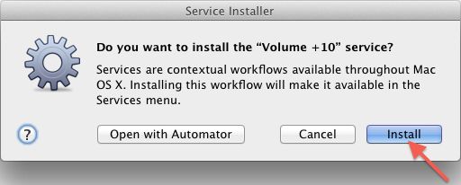
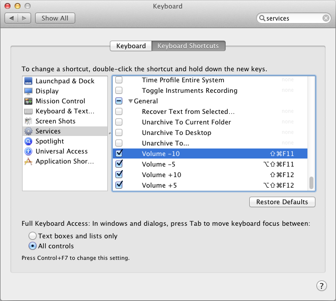

Volume Control Shortcuts for OS X
===

Adjust the volume in OS X from your keyboard.

Designed specifically for classic (non-Apple) keyboards that do not have media control buttons.

Based on Alvin Alexander's [iTunes AppleScript examples](http://alvinalexander.com/apple/itunes-applescript-examples-scripts-mac-reference).

Instructions
---

1. [Download here](https://github.com/nmostafavi/VolumeControlsOSX/archive/master.zip).
2. Double-click each workflow file, click *Install*, then click *Done*:  
   
3. Open *System Preferences*, go to *Keyboard* > *Keyboard Shortcuts* > *Services*, and specify shortcuts for each of the volume control options:  
   

That's it! Enjoy. 
